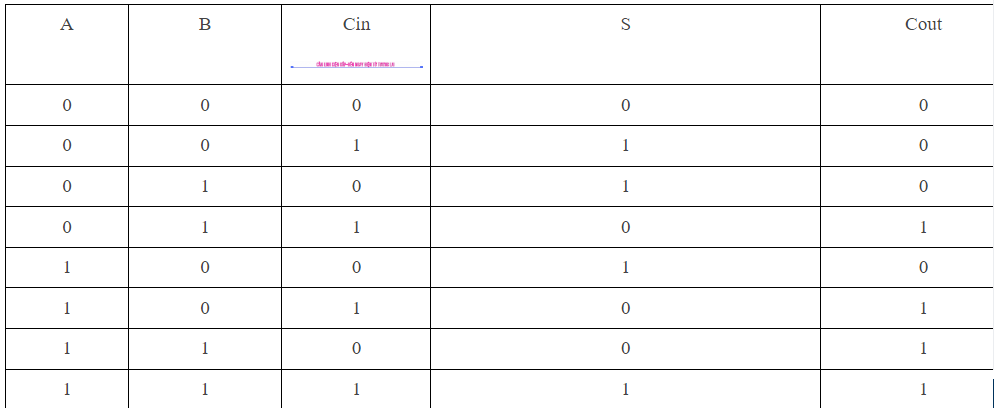
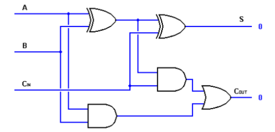
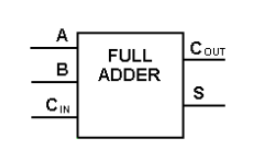
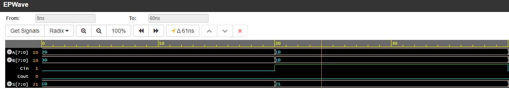

# Full Adder:
This type of circuit is a bit more difficult to implement than the half-adder circuit. The main difference between a half adder and a full adder is that a full adder has three inputs and two outputs.

The first two inputs are A and B and the third input is Cin which is the remainder of the previous calculation. When designing a full adder we will be able to chain eight of them together to create a wide and cascading adder that carries bits from one adder to the next.
## True Table:
  

## Full Adder Schematic:

  

## 1-bit Full Adder block:

  

### Source code 1-bit Full adder:
```SystemVerilog
module Full_Adder_by1(A,B,Cin,S,Cout);
  input wire A,B,Cin;
  output reg Cout,S;
  
  assign S=(A^B)^Cin;
  assign Cout=(A&B)|(Cin&(A^B));
endmodule
```

## 4-bit Full Adder:

  

### Source code 8-bit Full adder:

```SystemVerilog
module Full_Adder_by8(A,B,Cin,Cout,S);
  input wire [7:0]A;
  input wire [7:0]B;
  input wire Cin;
  output reg Cout;
  output reg [7:0]S;
  
  wire [6:0]Carries;
  Full_Adder_by1 add1(.A(A[0]),.B(B[0]),.Cin(Cin),.S(S[0]),.Cout(Carries[0]));
  Full_Adder_by1 add2(.A(A[1]),.B(B[1]),.Cin(Carries[0]),.S(S[1]),.Cout(Carries[1]));
  Full_Adder_by1 add3(.A(A[2]),.B(B[2]),.Cin(Carries[1]),.S(S[2]),.Cout(Carries[2]));
  Full_Adder_by1 add4(.A(A[3]),.B(B[3]),.Cin(Carries[2]),.S(S[3]),.Cout(Carries[3]));
  Full_Adder_by1 add5(.A(A[4]),.B(B[4]),.Cin(Carries[3]),.S(S[4]),.Cout(Carries[4]));
  Full_Adder_by1 add6(.A(A[5]),.B(B[5]),.Cin(Carries[4]),.S(S[5]),.Cout(Carries[5]));
  Full_Adder_by1 add7(.A(A[6]),.B(B[6]),.Cin(Carries[5]),.S(S[6]),.Cout(Carries[6]));
  Full_Adder_by1 add8(.A(A[7]),.B(B[7]),.Cin(Carries[6]),.S(S[7]),.Cout(Cout));
endmodule
```
## Simulation:
  
